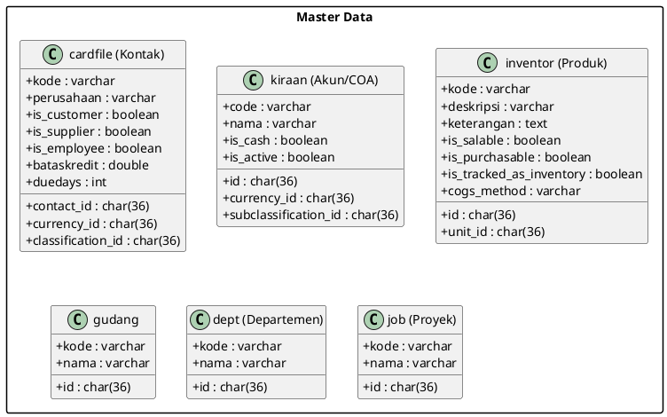
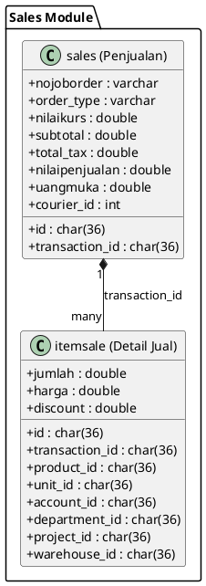
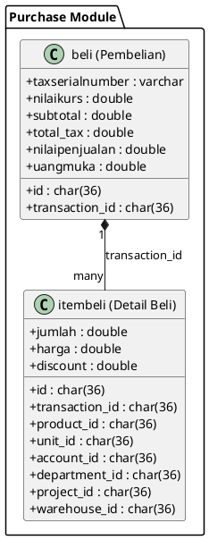
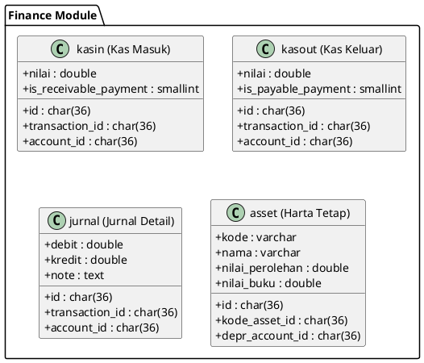

# Class Diagram - Sistem Berjalan (Zahir Accounting)

Class Diagram ini telah direvisi berdasarkan struktur database aktual Zahir Accounting (`db-zahir.sql`). Zahir menggunakan struktur tabel yang terpusat dan relasi antar tabel sering kali bersifat logis (tanpa Foreign Key constraint fisik di database).

## 1. Modul Manajemen Data Master

Tabel-tabel utama untuk data master:
- **cardfile**: Menyimpan seluruh data kontak (Pelanggan, Suplier, Karyawan, Salesman). Tipe kontak dibedakan oleh flag boolean (`is_customer`, `is_supplier`, dll).
- **inventor**: Menyimpan data produk/item barang dan jasa.
- **kiraan**: Menyimpan Chart of Accounts (Daftar Akun Anggaran).
- **gudang, dept, job**: Menyimpan data master lokasi, departemen, dan proyek.
- **unit, tax**: Menyimpan satuan pengukuran dan tarif pajak.

---

## 2. Siklus Penjualan (Sales Cycle)

- **sales**: Tabel utama (header) untuk transaksi penjualan. Jenis transaksi (Quotation, SO, DO, Invoice, Return) biasanya dibedakan oleh field `order_type`.
- **itemsale**: Tabel detail barang/jasa untuk setiap transaksi penjualan.

---

## 3. Siklus Pembelian (Purchase Cycle)

- **beli**: Tabel utama (header) untuk transaksi pembelian (PO, GR, Invoice).
- **itembeli**: Tabel detail barang/jasa untuk transaksi pembelian.

---

## 4. Keuangan & Jurnal (Finance)

- **kasin**: Tabel transaksi kas masuk (bukan hasil penjualan).
- **kasout**: Tabel transaksi kas keluar (biaya operasional, dll).
- **jurnal**: Tabel detail jurnal akuntansi (debit/kredit). Zahir mungkin menggunakan `g_jurnal` sebagai header atau langsung mengelola jurnal detail yang terhubung ke `transaction_id` dari modul lain.
- **asset**: Tabel harta tetap.

