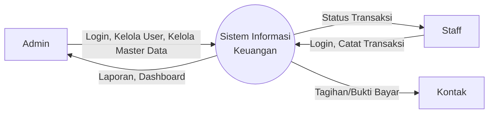
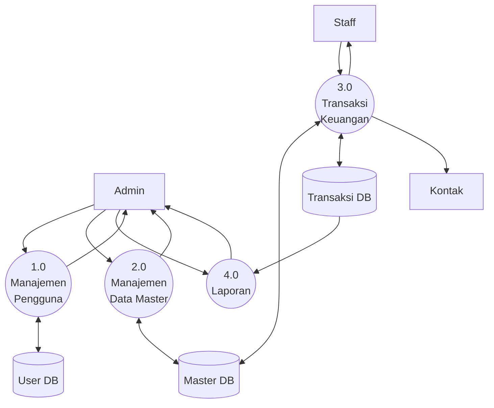
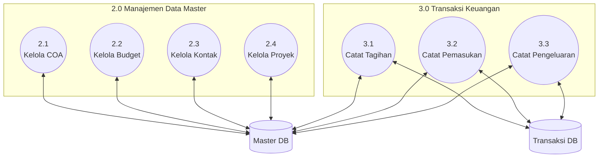

# Data Flow Diagrams (DFD)
> Buka di [Mermaid](https://www.mermaidchart.com/play)

## Diagram Konteks

```mermaid
flowchart LR
    %% Entities
    Admin[Admin]
    Staff[Staff]
    Contact[Kontak]

    %% System
    System((Sistem Informasi<br/>Keuangan))

    %% Flows
    Admin -- Login, Kelola User, Kelola Master Data --> System
    System -- Laporan, Dashboard --> Admin

    Staff -- Login, Catat Transaksi --> System
    System -- Status Transaksi --> Staff

    System -- Tagihan/Bukti Bayar --> Contact
```

## Diagram Level 0

```mermaid
flowchart TD
    %% Entities
    Admin[Admin]
    Staff[Staff]
    Contact[Kontak]

    %% Processes
    P1((1.0<br/>Manajemen<br/>Pengguna))
    P2((2.0<br/>Manajemen<br/>Data Master))
    P3((3.0<br/>Transaksi<br/>Keuangan))
    P4((4.0<br/>Laporan))

    %% Data Stores
    DS_User[(User DB)]
    DS_Master[(Master DB)]
    DS_Trx[(Transaksi DB)]

    %% Flows
    Admin --> P1
    P1 <--> DS_User
    P1 --> Admin

    Admin --> P2
    P2 <--> DS_Master
    P2 --> Admin

    Staff --> P3
    P3 <--> DS_Master
    P3 <--> DS_Trx
    P3 --> Staff
    P3 --> Contact

    Admin --> P4
    DS_Trx --> P4
    P4 --> Admin
```

## Diagram Rinci (Level 1) - Proses 2.0 & 3.0

```mermaid
flowchart TD
    %% Processes 2.0 Breakdown
    subgraph P2_Detail [2.0 Manajemen Data Master]
        direction TB
        P2_1((2.1<br/>Kelola COA))
        P2_2((2.2<br/>Kelola Budget))
        P2_3((2.3<br/>Kelola Kontak))
        P2_4((2.4<br/>Kelola Proyek))
    end

    %% Processes 3.0 Breakdown
    subgraph P3_Detail [3.0 Transaksi Keuangan]
        direction TB
        P3_1((3.1<br/>Catat Tagihan))
        P3_2((3.2<br/>Catat Pemasukan))
        P3_3((3.3<br/>Catat Pengeluaran))
    end

    %% Data Stores
    DS_Master[(Master DB)]
    DS_Trx[(Transaksi DB)]

    %% Flows
    P2_1 <--> DS_Master
    P2_2 <--> DS_Master
    P2_3 <--> DS_Master
    P2_4 <--> DS_Master

    P3_1 <--> DS_Master
    P3_1 <--> DS_Trx
    
    P3_2 <--> DS_Master
    P3_2 <--> DS_Trx

    P3_3 <--> DS_Master
    P3_3 <--> DS_Trx
```
