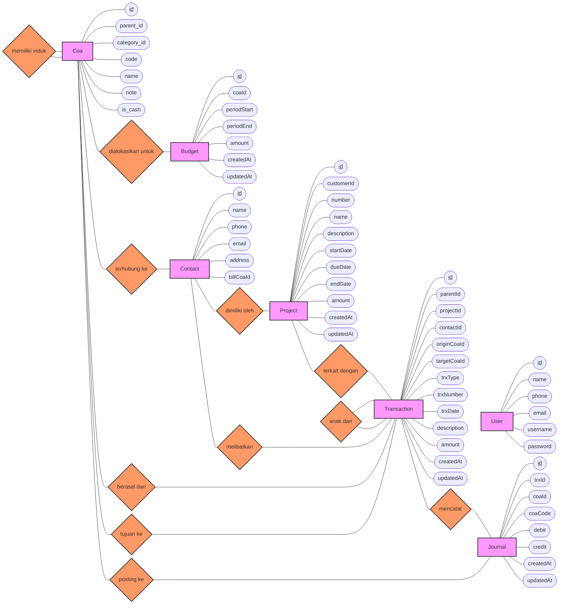

# Entity Relationship Diagram (Peter Chen Notation)
> Buka di [Mermaid](https://www.mermaidchart.com/play)

```mermaid
%%{init: {'flowchart': {'nodeSpacing': 10, 'rankSpacing': 20}}}%%
flowchart RL
    %% Entities & Attributes

    User[User]
    User_id([<u>id</u>]) --- User
    User_name([name]) --- User
    User_phone([phone]) --- User
    User_email([email]) --- User
    User_username([username]) --- User
    User_password([password]) --- User

    Budget[Budget]
    Budget_id([<u>id</u>]) --- Budget
    Budget_coaId([coaId]) --- Budget
    Budget_periodStart([periodStart]) --- Budget
    Budget_periodEnd([periodEnd]) --- Budget
    Budget_amount([amount]) --- Budget
    Budget_createdAt([createdAt]) --- Budget
    Budget_updatedAt([updatedAt]) --- Budget

    Coa[Coa]
    Coa_id([<u>id</u>]) --- Coa
    Coa_parentId([parent_id]) --- Coa
    Coa_categoryId([category_id]) --- Coa
    Coa_code([code]) --- Coa
    Coa_name([name]) --- Coa
    Coa_note([note]) --- Coa
    Coa_isCash([is_cash]) --- Coa

    Contact[Contact]
    Contact_id([<u>id</u>]) --- Contact
    Contact_name([name]) --- Contact
    Contact_phone([phone]) --- Contact
    Contact_email([email]) --- Contact
    Contact_address([address]) --- Contact
    Contact_billCoaId([billCoaId]) --- Contact

    Project[Project]
    Project_id([<u>id</u>]) --- Project
    Project_customerId([customerId]) --- Project
    Project_number([number]) --- Project
    Project_name([name]) --- Project
    Project_description([description]) --- Project
    Project_startDate([startDate]) --- Project
    Project_dueDate([dueDate]) --- Project
    Project_endDate([endDate]) --- Project
    Project_amount([amount]) --- Project
    Project_createdAt([createdAt]) --- Project
    Project_updatedAt([updatedAt]) --- Project

    Transaction[Transaction]
    Transaction_id([<u>id</u>]) --- Transaction
    Transaction_parentId([parentId]) --- Transaction
    Transaction_projectId([projectId]) --- Transaction
    Transaction_contactId([contactId]) --- Transaction
    Transaction_originCoaId([originCoaId]) --- Transaction
    Transaction_targetCoaId([targetCoaId]) --- Transaction
    Transaction_trxType([trxType]) --- Transaction
    Transaction_trxNumber([trxNumber]) --- Transaction
    Transaction_trxDate([trxDate]) --- Transaction
    Transaction_description([description]) --- Transaction
    Transaction_amount([amount]) --- Transaction
    Transaction_createdAt([createdAt]) --- Transaction
    Transaction_updatedAt([updatedAt]) --- Transaction

    Journal[Journal]
    Journal_id([<u>id</u>]) --- Journal
    Journal_trxId([trxId]) --- Journal
    Journal_coaId([coaId]) --- Journal
    Journal_coaCode([coaCode]) --- Journal
    Journal_debit([debit]) --- Journal
    Journal_credit([credit]) --- Journal
    Journal_createdAt([createdAt]) --- Journal
    Journal_updatedAt([updatedAt]) --- Journal

    %% Relationships

    %% Coa Hierarchy
    Coa --- Rel_Coa_Parent{memiliki induk}
    Rel_Coa_Parent --- Coa

    %% Budget - Coa
    Budget --- Rel_Budget_Coa{dialokasikan untuk}
    Rel_Budget_Coa --- Coa

    %% Contact - Coa (Bill Coa)
    Contact --- Rel_Contact_Coa{terhubung ke}
    Rel_Contact_Coa --- Coa

    %% Project - Contact (Customer)
    Project --- Rel_Project_Customer{dimiliki oleh}
    Rel_Project_Customer --- Contact

    %% Transaction - Project
    Transaction --- Rel_Trx_Project{terkait dengan}
    Rel_Trx_Project --- Project

    %% Transaction - Contact
    Transaction --- Rel_Trx_Contact{melibatkan}
    Rel_Trx_Contact --- Contact

    %% Transaction - Coa (Origin & Target)
    Transaction --- Rel_Trx_Origin{berasal dari}
    Rel_Trx_Origin --- Coa
    Transaction --- Rel_Trx_Target{tujuan ke}
    Rel_Trx_Target --- Coa

    %% Transaction - Parent Transaction
    Transaction --- Rel_Trx_Parent{anak dari}
    Rel_Trx_Parent --- Transaction

    %% Journal - Transaction
    Journal --- Rel_Journal_Trx{mencatat}
    Rel_Journal_Trx --- Transaction

    %% Journal - Coa
    Journal --- Rel_Journal_Coa{posting ke}
    Rel_Journal_Coa --- Coa

    %% Styling to mimic Peter Chen Notation
    classDef entity fill:#f9f,stroke:#333,stroke-width:2px;
    classDef relationship fill:#f96,stroke:#333,stroke-width:2px,shape:rhombus;
    classDef attribute fill:#fff,stroke:#333,stroke-width:1px,stroke-dasharray: 5 5;

    class User,Budget,Coa,Contact,Project,Transaction,Journal entity;
    class Rel_Coa_Parent,Rel_Budget_Coa,Rel_Contact_Coa,Rel_Project_Customer,Rel_Trx_Project,Rel_Trx_Contact,Rel_Trx_Origin,Rel_Trx_Target,Rel_Trx_Parent,Rel_Journal_Trx,Rel_Journal_Coa relationship;
```
